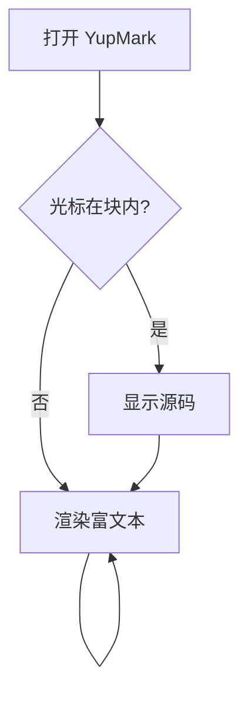
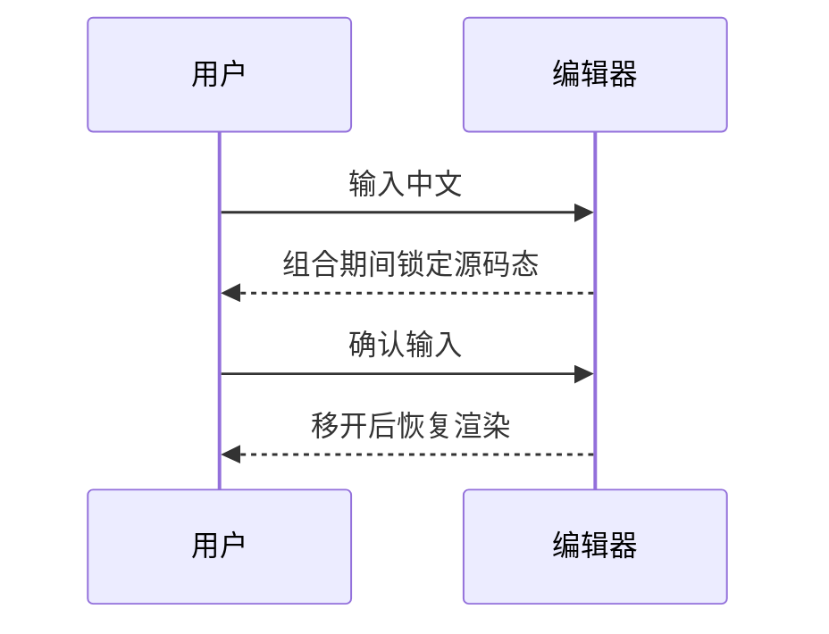

# M3 扩展语法体验

> 数学公式、Mermaid 图表、表格在光标离开时渲染，进入即回到源码编辑。

## 数学公式（KaTeX）

质能方程 $E = mc^2$ 是行内公式；欧拉公式 $e^{i\pi} + 1 = 0$ 也是。

块级公式独立成段并居中：

$$
\int_0^\infty e^{-x^2} \, dx = \frac{\sqrt{\pi}}{2}
$$

$$
\sum_{n=1}^{\infty} \frac{1}{n^2} = \frac{\pi^2}{6}
$$

## Mermaid 图表





## 表格

| 功能 | 状态 | 备注 |
| :--- | :---: | ---: |
| 行内公式 | ✅ | KaTeX |
| 块级公式 | ✅ | 居中显示 |
| Mermaid | ✅ | 懒加载 |
| 表格 | ✅ | 对齐生效 |

## 代码块（对照：始终源码态）

```ts
const answer = 42
```

## 智能粘贴

复制本行括号外的这个网址 `https://github.com`，然后选中下面四个字再按 ⌘V：

试试这里

（期望变成 [试试这里](https://github.com) 样式的链接）
