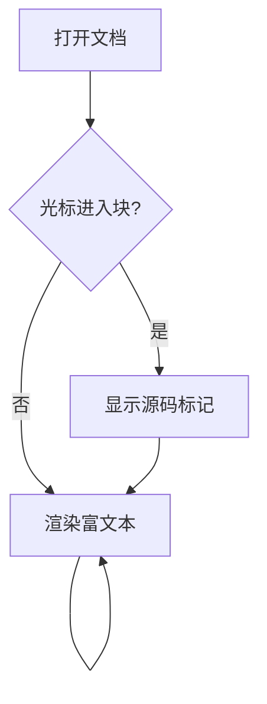
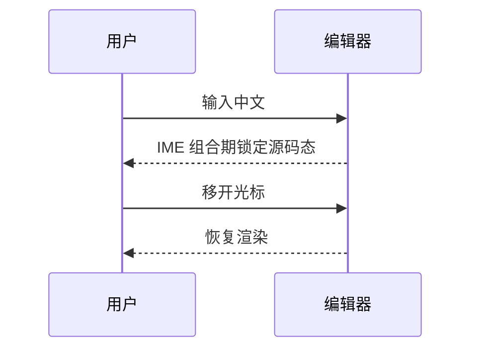

# Markdown 样式校验单

> 用途：在 YupMark 中打开本文件逐节核对。核心行为：语法标记默认隐藏（⌘/ 源码模式或 IME 输入临时显源码）；公式/表格/图表块光标进入即显源码可编辑，移开恢复渲染。

## 一、标题层级

# 一级标题 H1
## 二级标题 H2
### 三级标题 H3
#### 四级标题 H4
##### 五级标题 H5
###### 六级标题 H6

## 二、行内样式

**粗体**、*斜体*、***粗斜体***、~~删除线~~、`行内代码`，以及中英边界混排：**加粗中文 bold** 与 *斜体中文 italic*。

[行内链接](https://github.com/cnyup/yup-mark)（⌘点击应打开）、自动链接 <https://typora.io>。

转义测试：\*这里不是斜体\*，\`这里不是代码\`。

上下标与特殊符号直接走 Unicode：H₂O、x²、© 2026 YupMark。

## 三、引用

> 单层引用：引用内可以有 **粗体** 和 `代码`。

> > 嵌套两层引用：内层应整体再缩进。

> 引用内列表：
> - 第一项
> - 第二项

## 四、列表

### 无序与嵌套

- 顶层项一
  - 子项 1.1（两层缩进）
    - 孙项 1.1.1（三层缩进）
  - 子项 1.2
- 顶层项二，含 `行内代码`
- 顶层项三，含 **粗体**

### 有序列表

1. 第一步：安装
2. 第二步：配置
   1. 子步骤 2.1
   2. 子步骤 2.2
3. 第三步：运行

有序列表续编测试（源码故意从 5 开始，渲染应正确编号）：

5. 第五项
6. 第六项

### 任务列表

- [x] 已完成事项（复选框应可点击切换）
- [ ] 未完成事项
- [ ] 勾选我试试

## 五、代码块

```javascript
// JavaScript：关键字/字符串/注释应有语法高亮
export function greet(name) {
  return `你好, ${name}!`; // 模板字符串
}
```

```python
# Python 注释
def fib(n):
    a, b = 0, 1
    for _ in range(n):
        a, b = b, a + b
    return a
```

```bash
# Bash：中文注释不应对齐错乱
npm install && npm run dev:web
echo "构建完成 ✓"
```

```json
{
  "name": "yupmark",
  "version": "0.3.0",
  "platforms": ["macOS", "Windows", "Linux", "Terminal"]
}
```

```
无语言标注的代码块
保持原样输出即可
```

代码块底部应有语言选择器。

## 六、表格

| 语法 | 渲染预期 | 对齐方式 | 备注 |
| :--- | :---: | ---: | :--- |
| 粗体 | **加粗** | 左 | 基础行内样式 |
| 行内代码 | `code` | 中 | 灰底等宽 |
| 链接 | [链接](https://github.com) | 右 | ⌘点击可开 |
| 数学 | $E=mc^2$ | 左 | 行内公式 |

CJK 宽字符对齐测试（全角中文与半角英文混排，网格不错位）：

| 项目 | 金额（元） | 说明 |
| :--- | ---: | :--- |
| 开发工具 | 0 | 开源免费 |
| 许可证 | 0 | MIT |
| 合计 | 0 | 免费的爱 |

光标进入表格 → 网格化编辑 + 悬浮工具栏（增删行列/对齐/删表）；Tab/方向键应能跨格。

## 七、数学公式（KaTeX）

行内：质能方程 $E = mc^2$，欧拉公式 $e^{i\pi} + 1 = 0$（点击行内公式 → 原地显源码编辑）。

块级（分栏：左预览 / 右源码，失焦同步；右上角「预览」按钮可切纯渲染态）：

$$
\int_0^\infty e^{-x^2} \, dx = \frac{\sqrt{\pi}}{2}
$$

$$
\sum_{n=1}^{\infty} \frac{1}{n^2} = \frac{\pi^2}{6}
$$

矩阵：

$$
A = \begin{pmatrix} 1 & 2 \\ 3 & 4 \end{pmatrix}, \quad A^{-1} = \frac{1}{-2}\begin{pmatrix} 4 & -2 \\ -3 & 1 \end{pmatrix}
$$

## 八、Mermaid 图表（分栏：左图表 / 右源码，改码 ~0.3s 刷新；右上角「预览」可切纯渲染态）





## 九、图片与分隔线

本地图片（相对路径，走 asset 协议）：


远程图片（需联网）：


---

## 十、长段落与换行

这是一个较长的中英混排段落，用于检验自动软换行与排版密度：YupMark 是一个开源、免费、类 Typora 的所见即所得 Markdown 编辑器，基于 CodeMirror 6 与 lezer-markdown 自研渲染引擎，桌面端自 v0.3.0 起基于 Tauri 2 构建，同一编辑内核 @yupmark/live-cm 同时驱动桌面版与终端 TUI 版，做到四端一致的书写体验。

段落内强制换行（行尾两个空格后回车）：
第一行  
第二行（应紧邻上一行，不产生新段落）

## 校验清单

以下本身就是任务列表语法，逐项核对时可点击勾选：

- [ ] 渲染态编辑：标题/粗体/引用标记默认隐藏；⌘/ 全显源码；块级公式/mermaid 分栏（左预览右源码）；行内公式点击编辑；表格单元格点击编辑
- [ ] 中文 IME 输入不掉字、不跳光标
- [ ] ⌘F 查找 / ⌥⌘F 替换，命中能在渲染态块内定位
- [ ] 列表行内 Tab / ⇧Tab 升降层级，有序列表自动重编号
- [ ] 表格单元格点击编辑、工具栏增删行列
- [ ] 任务列表复选框点击切换
- [ ] 代码块语言选择器
- [ ] ⌘/ 源码模式、F8 专注模式、F9 打字机模式（状态栏徽章可退出）
- [ ] ⌘, 设置页：8 套主题即时切换、字体、快捷键重绑
- [ ] 大纲面板层级正确
- [ ] 自动保存（状态栏绿 ✓）后重开内容一致
